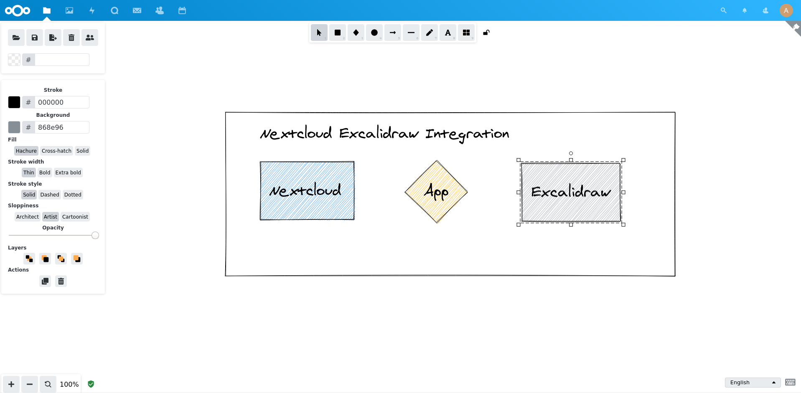

# Excalidraw
This app allows you to edit Excalidraw drawings right in your Nextcloud.
It currently does not support collaboration, but this is on the roadmap.
This is a personal project of mine, so use at your own risk!

This projects code is heavily based on [Mind Map Editor](https://github.com/ACTom/files_mindmap) - thanks!



## Dependencies
- PHP
- NPM
- make
- tar, which, curl

## Installation
This app is not in the official app store at the moment due to its early stage of development.
To install it manually, do the following:

```
git clone https://github.com/Turakar/nextcloud-excalidraw.git
cd nextcloud-excalidraw
make
make appstore
```

This will create `build/artifacts/appstore/nextcloud-excalidraw.tar.gz`.
Extract the contents of this file to your `apps/` folder.
Then enable the app via the web interface and run

```
occ maintenance:repair
```

This updates the MIME-type associations and adds the file icon.

## Development
I use docker-compose for development.

```
sudo docker-compose up
```

To install the app, run one of the following:

```
./to-docker-debug.sh
./to-docker-production.sh
```

## Roadmap
- Testing
- Collaboration, see this [issue](https://github.com/excalidraw/excalidraw-embed/issues/28)
